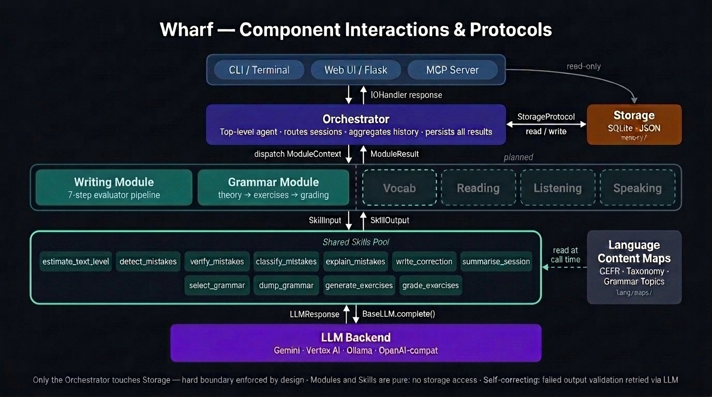
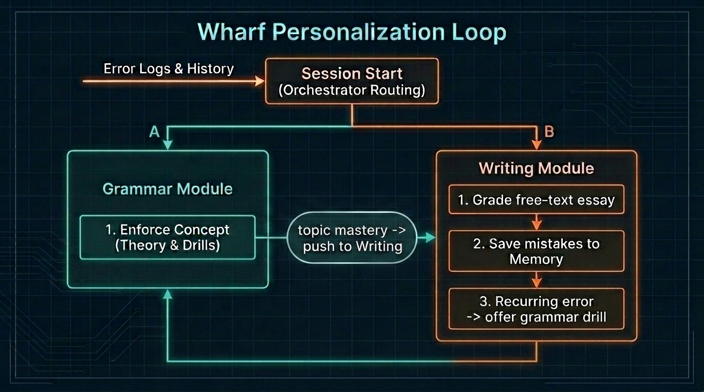
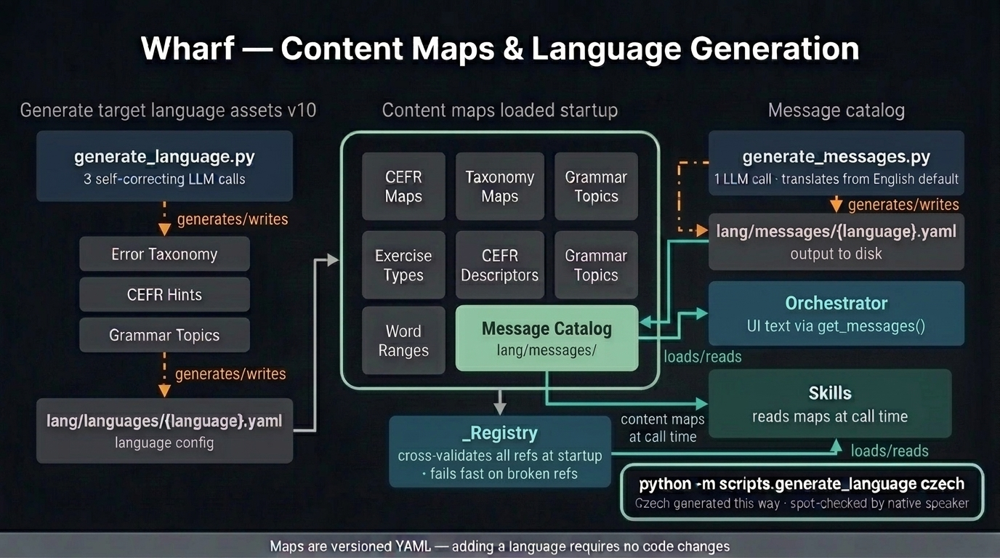
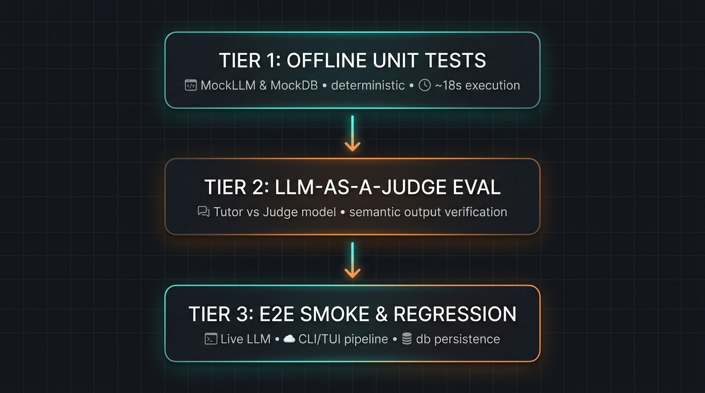

# Wharf: Demolishing the Paywall of Corrective Language Tutoring with a Multi-Agent Architecture

### Capstone Writeup
* **Track:** Agents for Good (Advancing Education)
* **Author:** Jan Krejci, Bhavyajeet Singh
* **GitHub Repository:** [https://github.com/cookieTroll/language-tutor](https://github.com/cookieTroll/language-tutor) — see `QUICK_START.md` for the fastest path to a first session

---

## 1. Executive Summary & Problem Statement

Wharf is a language learning tool built entirely around language output. This project was born out of a real-world struggle. After moving to Germany as a working professional with zero prior knowledge of German, I hit two massive roadblocks to achieving fluency:
1. **The Production Bottleneck:** Traditional language apps focus on passive recognition like flashcards or clicking pre-arranged words. But to learn fast, you need active production such as writing and speaking, paired with immediate, corrective feedback.
2. **The Flexibility and Cost Trap:** Private tutors are expensive, and group classes lock you into rigid schedules. Even in those settings, a teacher's bandwidth for grading essays and providing detailed, personalized feedback is limited.

Large Language Models (LLMs) are uniquely suited to language processing, offering a natural solution. However, getting feedback from raw LLM chats (like pasting sentences into ChatGPT or Claude) is cumbersome. It forces you to juggle several different environments (chat web apps for translation, separate note files for error tracking, and flashcard apps for vocabulary review) and lacks good persistence. With no historical memory of what you have practiced, no error tracking, and no adaptive routing, every session starts from scratch.

Wharf bridges this gap. It is a self-hosted, multi-agent AI language tutor designed to make corrected-output feedback free or almost free, private, and personalized. Operating on a client-owned LLM API key or a fully offline local model, Wharf tracks progress, identifies recurring errors, dynamically builds custom grammar exercises, and routes the student through a personalized learning path.

---

## 2. Why Agents? Beyond Single LLM Calls

A simple "correct this text" prompt is insufficient for language learning. If a student is given a list of raw corrections, they do not learn *why* they were wrong, how it relates to their current proficiency level, or how to practice that specific grammatical concept.

Wharf replaces the single-prompt approach with an agentic architecture that orchestrates multiple specialized components:
- **Intelligent Routing:** The system decides whether to prompt the user for free-writing, recommend a targeted grammar lesson based on historical weaknesses, or continue a previous thread.
- **Multi-Step Evaluation:** The writing evaluator is a structured pipeline that isolates concerns (e.g., level estimation, mistake detection, false-positive verification, pedagogical explanation) into separate steps, preventing LLM context dilution and hallucinations.
- **Cross-Competency Bridge:** While commercial platforms offer basic streak and progress tracking, their competencies are siloed. Wharf integrates these: when a pattern of recurring errors is detected in the writing module, it triggers a state transition that dynamically recommends a custom grammar lesson and drill on the fly, bridging the two skills.
- **Dynamic Asset Generation:** Adding support for a new target language requires synthesizing a pedagogical syllabus (CEFR hints, error taxonomies). Wharf utilizes a self-correcting agent chain to generate these YAML assets dynamically from scratch.

---

## 3. System Architecture & Core Design Decisions

Wharf is implemented using a custom **Three-Grain Architecture** designed to enforce strict separation of concerns, testability, and load-bearing interface contracts. 



### Grain 1: Skills (Atomic Actions)
Skills are the smallest functional units (e.g., `detect_mistakes`, `explain_mistakes`, `grade_exercises`). 
* **Purity:** Skills are stateless and pure. They have no knowledge of the database, the active user, or specific provider SDKs. They receive input via typed dataclasses (`SkillInput`), call the LLM through a unified abstraction (`BaseLLM`), validate the JSON response using Pydantic, and return a typed `SkillOutput`.
* **Shared Pool:** All skills reside in a top-level `skills/` directory. They are a shared, project-wide asset pool. For example, the `btw_handler` (an inline translation and Q&A assistant) is a utility skill that can be injected into any module.

### Grain 2: Modules (Sub-Agents)
Modules (e.g., `WritingModule`, `GrammarModule`) represent specific competencies. 
* **Orchestration:** A module receives a set of injected skills and a `ModuleContext` (containing the user profile and past logs). It orchestrates the execution flow. For example, the `WritingModule` coordinates the 7-step evaluator pipeline.
* **Storage-Decoupled:** Modules do not write to disk or query the database. They declare what data they need via a `ContextRequest` and return their outcomes via a `ModuleResult`.

### Grain 3: Orchestrator (Top-Level Agent)
The Orchestrator is the single, authoritative coordinator. 
* **State & Persistence:** It is the only component allowed to touch the database (`memory/`). It handles cold starts, manages session checkpoints, aggregates logs, and persists session files, vocabulary flags, and mistake tags.
* **Routing:** On startup, it reads the user’s history, builds a progress summary, and routes the student to the appropriate competency module.

### The Memory Boundary & Protocols
The boundary is enforced by code, not convention. Because modules and skills are pure and communicate via typed protocols (`ModuleProtocol`, `SkillProtocol`), they can be developed and tested in isolation without spawning a database or making real network calls.

---

## 4. The Centerpiece: The Writing↔Grammar Personalization Loop

The core pedagogical value of Wharf lies in the bidirectional bridge between the Writing and Grammar competencies, sharing one history.



1. **Error Detection and Taxonomy Mapping:** 
   When a student completes a writing session, their text is processed. The `detect_mistakes` skill highlights erroneous fragments. The `verify_mistakes` skill filters out false positives by double-checking the candidate errors against the sentence context. The `classify_mistakes` skill maps the errors to a structured, language-specific taxonomy (e.g., `verb_conjugation`, `noun_adjective_agreement`).

2. **Pedagogical Explanation and Severity:** 
   Feedback is calibrated to the student's current CEFR level. If an A2 student makes a B2-level error (e.g., complex subjunctive usage), the system flags it as `minor` and provides a brief hint. If they make a basic A1 error (e.g., subject-verb agreement), it is flagged as `critical` and triggers a detailed, structural explanation.

3. **Routing to Grammar Drills:** 
   The Orchestrator monitors the frequency of error tags within the current session's accumulated logs. If a specific taxonomy tag recurs (frequency ≥ 2), the Orchestrator generates a bridge recommendation. Upon starting the next session, the learner is prompted: *"We noticed a recurring issue with Verb-Second Word Order. Would you like to practice this now?"*

4. **Dynamic Theory & Exercise Generation:** 
   If accepted, the `GrammarModule` is invoked:
   - `dump_grammar` generates a concise theory sheet for that specific error category.
   - `generate_exercises` generates custom gap-fill or sentence-reformulation drills on the fly.
   - `grade_exercises` evaluates the responses, updates the mastery ratio in the SQLite store, and registers vocabulary flags for terms the user queried mid-session via `/btw`.
   
Once a grammar topic is mastered, the bridge operates in reverse: the Orchestrator suggests a writing topic designed to elicit the newly mastered grammar pattern, closing the loop.

---

## 5. Automated Language Asset Generation (Validation vs. Rewrite)

Supporting multiple target languages (L2) and different communication languages (L1) traditionally requires hand-crafting grammatical taxonomies, CEFR rules, and localized UI strings. This approach does not scale.

Wharf solves this via a **data-driven language subsystem** (`lang/`). All language-specific rules, taxonomies, and localized UI strings reside in versioned YAML files (`lang/languages/` and `lang/messages/`). The loader (`lang/loader.py`) parses and cross-validates these references at startup, acting as a compiler that fails fast if files refer to non-existent maps.

To add a language, a developer runs:
```bash
python -m scripts.generate_language czech
```

This script triggers a three-stage self-correcting agent pipeline:
1. **Taxonomy Synthesis:** Generates a structured error taxonomy tailored to the target language's grammatical features.
2. **Pedagogical Asset Generation:** Creates CEFR-specific hints and writing prompt requirements.
3. **Grammar Curriculum Synthesis:** Establishes the roadmap of grammar topics to be taught.

Each step is constrained by Pydantic schemas. If the generated YAML violates the registry's validation checks, the error is fed back to the LLM for self-correction. By using this pipeline, the target language **Czech** was generated from scratch. Native-speaker spot-checks confirmed that the output was highly accurate, proving that adding a language is a **validation task, not a codebase rewrite**.

Both `gemma2:9b` (local) and `gemini-2.5-flash` (hosted) were tested for this pipeline; the accuracy gap is significant relative to the price difference. For content generation specifically, use the hosted model where possible, or a stronger local model if not.



---

## 6. Deployability, Configuration & Security

Wharf prioritizes user choice between cloud capability and absolute privacy, implementing key course concepts directly:

### Configurable LLM Backend & Deployability
A single configuration file switcher (`LTUT_CONFIG`) changes the execution environment without code modifications:
- **Local Path (Ollama):** Targets local models (defaulting to `gemma2:9b`). Perfect for offline, zero-data-leak execution. Running locally requires suitable hardware (a dedicated GPU with ~6–8 GB VRAM to achieve acceptable token generation speeds). Local models represent the lower end of feedback accuracy compared to hosted commercial alternatives.
- **Hosted Path (Gemini / Vertex AI):** Targets hosted models. A typical session (100-word essay evaluation or grammar drill) costs a fraction of a cent on `gemini-2.5-flash`. A full study monthly load of 60 sessions (2 sessions/day combining essay grading, grammar theory dumps, and exercises) runs **roughly €1 per month**. The prompt context (system prompts and taxonomy details) represents the bulk of the cost, making pricing highly flat and predictable. Furthermore, as a local library of generated lessons and exercises is gradually compiled, subsequent study sessions on those cached topics bypass the LLM entirely, reducing upkeep costs even further.
- **Vertex AI:** Uses Application Default Credentials (ADC), allowing enterprises to authenticate natively via IAM without managing static keys.

### Security Posture
- **Key Isolation:** API keys are never hardcoded; `config.py` resolves `${VAR_NAME}` syntax against the operating system's environment variables at runtime.
- **Strict Input/Output Validation:** Every LLM response is Pydantic-validated. All user-input strings are sanitized, and the web UI enforces path-traversal guards on file reads, checking that resolved paths stay strictly within the designated `data_root`.

### MCP Server — Programmatic Access Layer
`ui/mcp_server.py` exposes the session and progress storage layer as a read-only MCP server with 10 typed tools: `list_users`, `list_languages`, `get_progress`, `list_sessions`, `get_session`, `get_recurring_errors`, `get_vocab_flags`, `export_writing_history`, `get_error_taxonomy`, and `get_grammar_topic_list`. No LLM calls, no writes. The server speaks MCP over stdio and connects to any MCP-compatible client (e.g., Claude Desktop) without code changes.

---

## 7. Testing Strategy: Three-Tier Offline Testing & LLM-as-a-Judge

To verify the agentic pipelines without generating massive API bills or relying on live connections, Wharf uses a three-tier testing architecture:



1. **Tier 1: Unit Tests (Deterministic)**
   Wharf includes **379 unit tests** that execute in under 20 seconds. They run completely offline against a `MockLLM` and an isolated memory-resident JSON store, verifying state transitions, menu routing, and edge-case configs.

2. **Tier 2: Semantic Evaluation (LLM-as-a-Judge)**
   Because grading and correcting text are subjective, unit tests cannot verify quality. The `tests/judge/` suite implements a two-LLM judge framework:
   - One model executes the skill (e.g., `detect_mistakes`).
   - A separate, larger evaluator model grades the output against ground-truth student submissions.
   - This suite was used to select the default local model: `gemma2:9b` achieved 12/12 correct evaluations on the mistake detection benchmark, whereas `qwen2.5:7b` failed 4 evaluations, setting `gemma2:9b` as our local baseline. The tooling for repeated variance sweeps (`scripts/run_judge_variance.py`) exists and is configured; full statistical stability across repeated runs was not measured within the project scope.

3. **Tier 3: Regression Suite**
   Whenever a prompt hallucination or bug is identified, a test case is added to the regression suite. The rule "Tests before commit" is enforced workspace-wide to ensure zero regression before code changes are merged.

---

## 8. Project Journey, Honest Scope & Limitations

### Project Scope & Current Limitations
Wharf is a functional tool, but it has defined boundaries:
- **Language Scope:** The pedagogical taxonomies are fully validated for German (A1–B2). Czech has been generated and validated at the file level but has not been put through long-term student trials.
- **Hardware Boundary:** While the hosted Gemini path runs on any lightweight client, the offline path requires suitable local hardware (a dedicated GPU with at least 6–8 GB VRAM to run the tutor model at usable speeds). Additionally, local models represent the lower end of grading and pedagogical accuracy compared to hosted commercial options.
- **Bridge Horizon:** The writing↔grammar bridge computes recurring errors within a single session's scope. Cross-session historical aggregation is a planned improvement.
- **Single-User Auth:** The current Flask web app is single-user or self-hosted, storing data relative to a local root folder. Multi-user SaaS deployment would require adding a web-security and OAuth layer.

### What Was Learned & Future Outlook

Building Wharf was a personal journey that allowed me to explore several advanced engineering paradigms:
- **Local Model Serving:** Configured and evaluated offline models locally using Ollama, navigating the trade-offs of hardware requirements versus latency and accuracy.
- **Strict Contractual Boundaries:** Designed a comprehensive project around a Three-Grain Architecture where interfaces are enforced by strict boundaries. Pure skills and modules communicate through explicit schemas, proving that LLM inputs/outputs can be caged safely.
- **LLM-as-a-Judge Evaluation:** Implemented a two-LLM evaluation benchmark. While this was done in a limited scope (variance and temperature stability were not statistically tested), the test results were validated by manual reviews and served as a reliable baseline for model selection.
- **Intent-Driven Coding:** Experienced intent-driven development by pairing with an agentic coder. Expressing design thoughts via high-level goals and letting the agent synthesize code, synchronize documentation, and run verification loops represents a fundamental shift from traditional coding paradigms.

Since the core orchestrator and the memory boundaries are solid, expanding Wharf to other competencies is straightforward. The future roadmap includes:
1. **Unified Vocabulary & Note Ingestion:** Building an OCR and LLM pipeline to process handwritten study notes and import them along with Anki cards into Wharf, making it a single place where vocabulary is tracked and revised.
2. **Engaging Reading Module:** Developing a reading comprehension module connected to web media and articles, letting students read interesting content and answer contextual questions.
3. **Listening & Speaking:** Tackling the most challenging competencies: first, a listening comprehension module, and second, an interactive speaking module leveraging text-to-speech and speech-to-text integrations.
